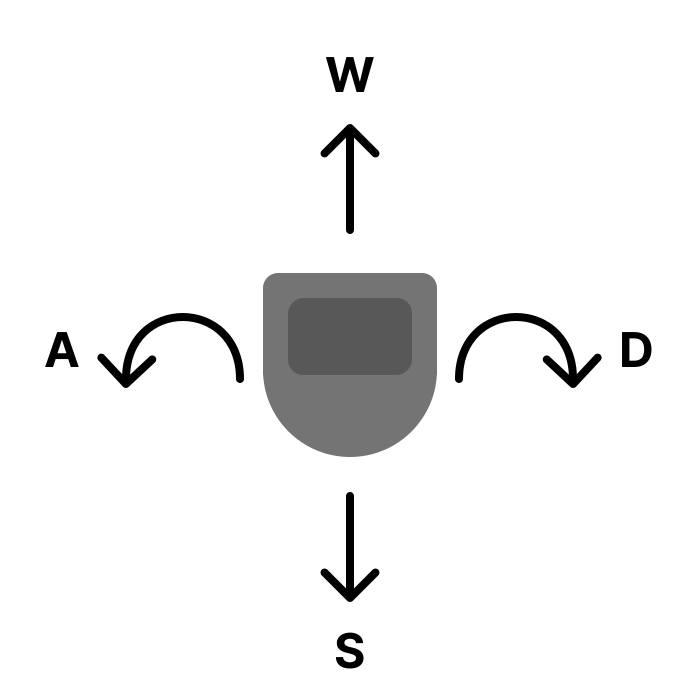
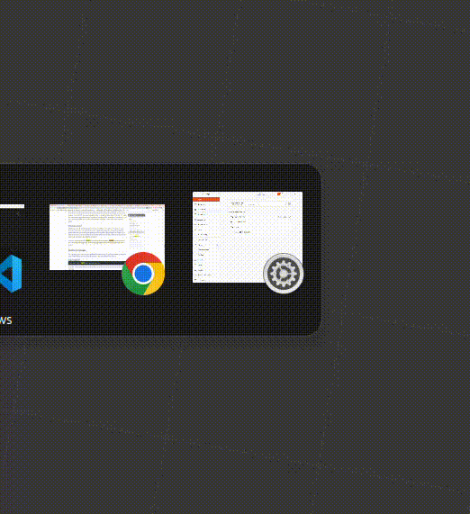
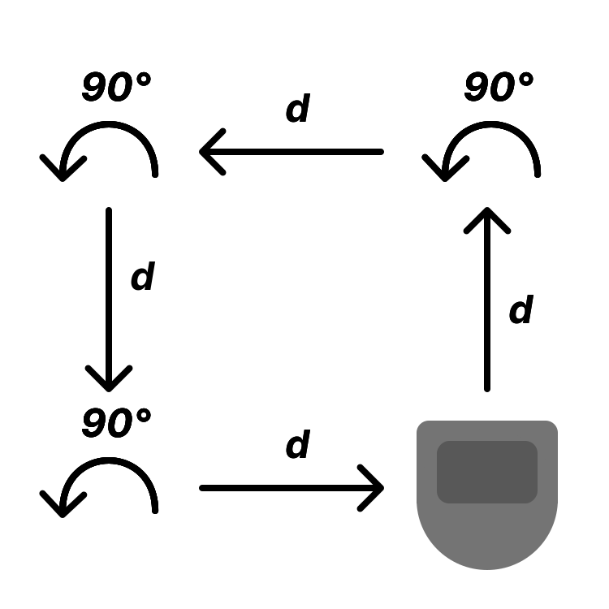
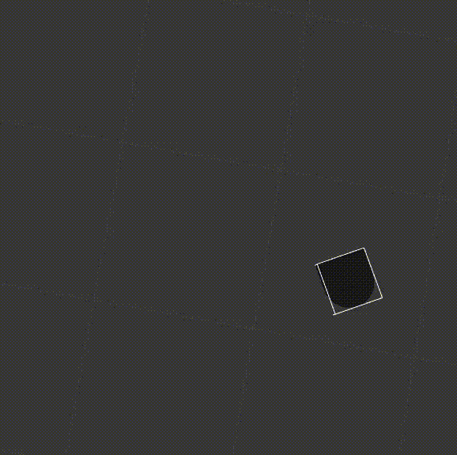
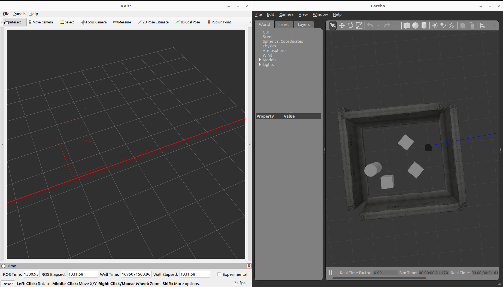
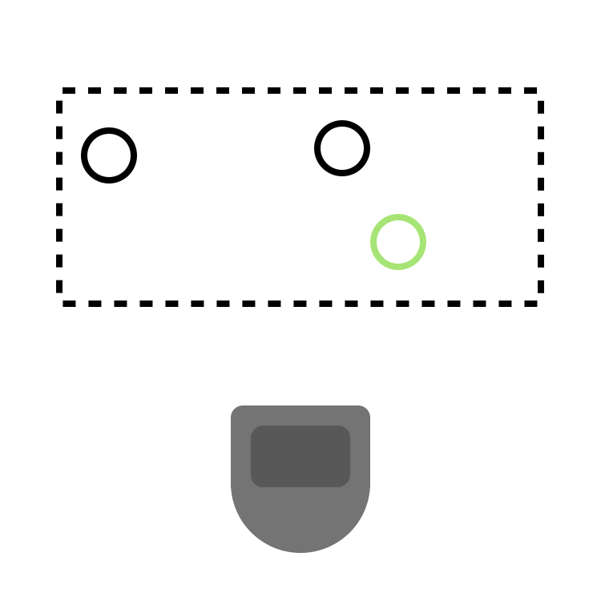
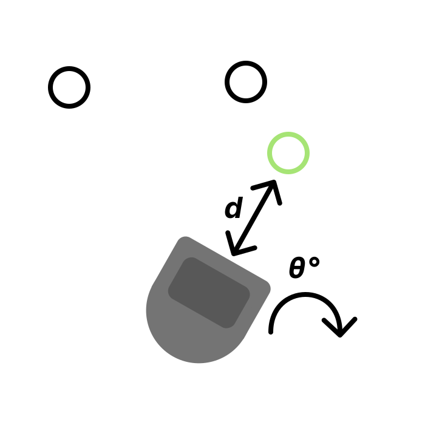
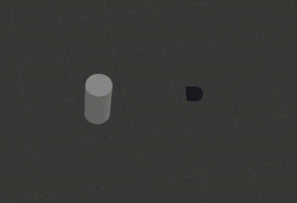
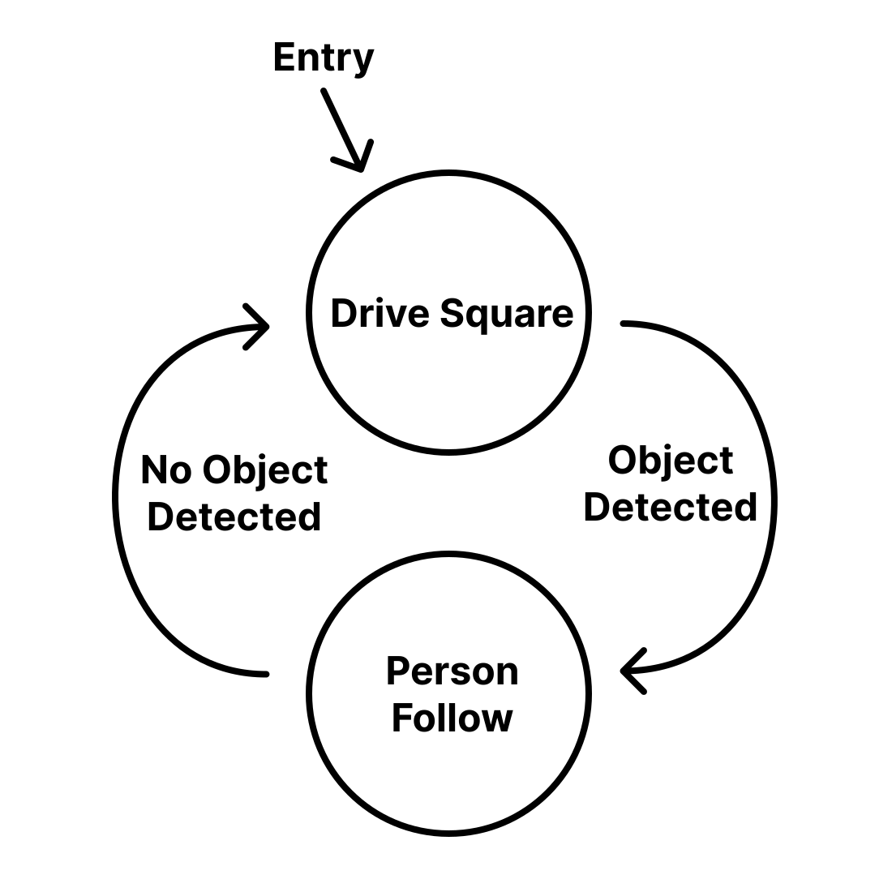
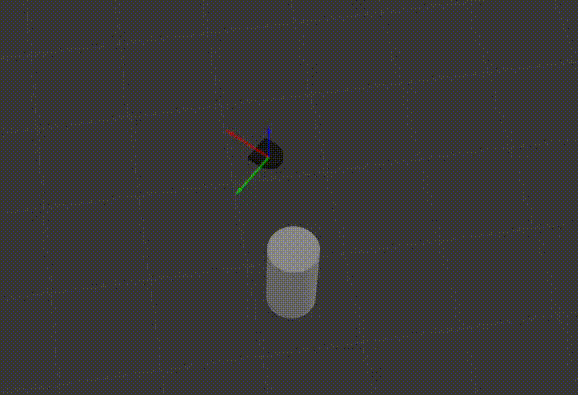

# Introduction

As part of a warmup to ROS2, we took on a series of mini-projects that allowed us implement ROS2 nodes of our own. We employed various algorithms to achieve the tasks, learning a lot along the way.

# Table of Contents
The mini-projects were as follows:
1. Teleop with key bindings
2. Drive in a square
3. Follow a wall
4. Follow a person/object
5. Avoid a person/object
6. Create a Finite State Diagram (FSD) of several behaviors

# Teleop

## Problem

The NEATO by itself can't do much without a controller. Yes, it can gather data about its surroundings but without a node telling it what to do, the NEATO will remain stationary. For this sub-project, the task is to create a node that allows a user to control the NEATO using keybinds. A successful outcome to this task looks like: The user can drive the NEATO forward by pressing w, backward by pressing s, turn right by pressing d, and turn left by pressing a.

<div style="text-align:center">
    
</div>

## Strategy / Structure

Since this was the first sub-project, we wanted to start with the bare minimum before adding any complexity. Our strategy consisted of iterative development which looked like this: First, take the provided code and add an if statement to capture the pressing of the w key.

```python
def getKey():
    tty.setraw(sys.stdin.fileno())
    select.select([sys.stdin], [], [], 0)
    key = sys.stdin.read(1)
    termios.tcsetattr(sys.stdin, termios.TCSADRAIN, settings)
    return key

settings = termios.tcgetattr(sys.stdin)
key = None

while key != '\x03':
    key = getKey()
    if (key == "w"):
        print("W pressed!")
```

Once we saw that we can chance the control flow of the program, we replaced the print statement with a control message to send to the NEATO.

```python
if (key == "w"):
    msg.linear.x = 0.2
    msg.angular.z = 0.0

self.pub.publish(msg)
```

This gave us control to drive the NEATO forward. The last step of our iterative development strategy was to add the rest of the controls which was a trivial considering we already had the base case for the W key working.

```python
match key:
    case "w":
        msg.linear.x = 0.2
        msg.angular.z = 0.0
    case "a":
        msg.linear.x = 0.0
        msg.angular.z = 0.5
    case "s":
        msg.linear.x = -0.2
        msg.angular.z = 0.0
    case "d":
        msg.linear.x = 0.0
        msg.angular.z = -0.5

self.pub.publish(msg)
```

## Visualization

## Challenges

Not many challenges arise when using the incremental development strategy! This sub project was also very simple, most of the challenges came from getting the ROS environment to run properly. Using aliases to run a chain of commands also sped up this interative process by a large factor.

# Driving in a Square

## Problem

Now that we know that we know that the NEATO is controllable, we would like to hand off control to a computer instead of manually pressing the w, a, s, and d keys. In this problem, we are tasked to make the NEATO drive in a square autonomously. A successful outcome to this task looks like: The NEATO drives forward some determined distance, rotates left 90 degrees, drives forward some determined distance, and so on.

<div style="text-align:center">
    
</div>

## Strategy / Structure

On top of using an iterative development approach, we also decided that breaking down the problem into its fundamental components would make it simpler to approach. By looking at the neccassary actions for the NEATO to take, we noticed that there were only two translational actions the NEATO makes: drive forward distance _d_ and turn left 90°. Turning these two actions into functions is trivial:

```python
def move_forward(self, msg):
    msg.linear.x = 0.2
    msg.angular.z = 0.0
    self.pub.publish(msg)
    sleep(5)
    msg.linear.x = 0.0
    msg.angular.z = 0.0
    self.pub.publish(msg)

def turn_left(self, msg):
    msg.linear.x = 0.0
    msg.angular.z = 0.5
    self.pub.publish(msg)
    sleep(3.3)
    msg.linear.x = 0.0
    msg.angular.z = 0.0
    self.pub.publish(msg)
```

There were some non-obvious questions to answer however: How do we turn exactly 90° and how do we drive exactly distance d. Since we wanted to simple timing instead of the NEATO's odometry, the simple answer is we couldn't get the NEATO to turn and move exactly how we wanted. By utilizing gazebo and through trial and error, we tried various timing values for the move_forward and turn_left function until we got movements that we were happy with.

Now that we had our fundamental movement blocks, we moved one step up the NEATO's trajectory hierarchy to realize that to drive in a square requires moving forward and left repeatadly. Since we have functions that define these two movements, implementing this more complex movement is done by chaining them together in our main run loop:

```python
def run_loop(self):
    msg = Twist()
    self.move_forward(msg)
    self.turn_left(msg)
```

## Visualization


## Challenges

Finding the correct timings of to get a 90 degree turn was tedious and could be remedied by utilizing the NEATO's onboard odometry. Other than that, this sub project remained rather simple. A great extension would be to add threading so that other processes on the robot aren't blocked by the sleep statements.

# Wall Following

## Problem

The goal of this task was to perform wall-following using laser-scan data. What that means is, the robot has to remain parallel to a wall as it moves forward, and remain as close as possible to a fixed distance away from the wall.

## Strategy / Structure

Our wall follower algorithm stays parallel to the wall by ensuring that its distance measurement at a 45 degree angle and at a 135 degree angle remain close within some threshold $\epsilon$
$$|d_1 - d_2| < \epsilon$$
where 
* $d_1$ represents the distance measurement taken from the LiDAR at a 45 degree angle
* d_2 represents the distance measurement taken from the LiDAR at a 135 degree angle

If that criteria is not met, we adjust the robots direction by rotating it. If $d_1 > d_2$, we turn right. If $d_2 > d_1$, we turn left.

We execute the turns by updating the angular velocities of the Twist messages. We adjust the angular velocities about the z-axis.

In our script, $\epsilon=0.1$

As an extension, we decided to perform wall detection using a Hough Transform with $\rho-\theta$ parameterization, where 
* $\rho$ is the perpendicular distance from the origin and 
* $\theta$ is the angle from the x axis to $\rho$
 
We verify the algorithm's implementation and visualize its voting procedure in the form of a heat map. The heat map is created using Matplotlib and Seaborn.

We start by converting the polar coordinates from the LiDAR scan data to Cartesian coordinates using the standard conversion:

$$x = r\cos(\theta)$$

$$y = r\sin(\theta)$$

where $r$ is the distance corresponding to each angle represented in the LiDAR scan.

We convert to Cartesian coordinates so that the $\rho$ value can be calculated using 
$$\rho = x\cos(
\theta) + y\sin(\theta)$$

Once the $\rho$ value is calculated for each $\theta$ and coordinate pair, we determine which bin (in the discretized Hough space) needs to be incremented. We do this by normalizing with the minimum  $\rho$ value, $\rho_{min}$, and dividing by the resolution of the $\rho$ values ($\rho_{r}$)
$$\text{bin} = \frac{\rho - \rho_{min}}{\rho_{r}}$$

Here are the specific implementation details:
 ~~~python
def generate_hough_space(self, points):
    
    # Create an accumulator matrix initialized to zeros. The dimensions are determined by 
    # the number of r_values (rho values) and thetas (angle values).
    accumulator = np.zeros((len(self.r_values), len(self.thetas)))
    
    # Iterate through each Cartesian point (x,y) from the provided list.
    for point in points:
        
        # For each point, calculate its representation in Hough space by iterating through 
        # all possible theta values.
        for index, theta in enumerate(self.thetas):
            
            # Calculate the r (rho) value for the current point and theta combination.
            # This represents the perpendicular distance from the origin to the line defined by 
            # the point and angle theta.
            r = point[0] * cos(theta) + point[1] * sin(theta)
            
            # Convert the calculated r value to its corresponding bucket/index in the accumulator matrix.
            # This is done by normalizing with r_min (minimum r value) and dividing by r_step 
            # (resolution of r values).
            bin = int((r - self.r_min) / self.r_step)
            
            # Check if the calculated bin is within valid index bounds of the accumulator matrix.
            # If valid, increment the vote count for the corresponding (r, theta) combination.
            if 0 <= bin < len(self.r_values):
                accumulator[bin][index] += 1
                
    # Return the filled accumulator matrix representing the Hough space.
    return accumulator

~~~
Then, we use a Seaborn heatmap to illustrate the “hottest” bins with the highest value/number of votes. The $\rho-\theta$ pairs in the hottest 30% of bins are converted back into lines represented by markers. Those markers are then published to their own topic so the detected wall can be visualized in RViz. We calculate our threshold in this way so that it is dynamic and not reliant on hard-coded values that vary depending on the situation. For the sake of time, the Hough Transform does not influence our wall following- it simply serves to detect the walls and in the future could be used to follow walls.

<div style="text-align:center">
    
</div> 

Here are the details of the heat map and wall visualizations: 
~~~python
def plot_lines(self, accumulator):
    # Get the maximum value from the accumulator matrix
    max_value = np.max(accumulator)

    # Set a threshold to be 70% of the highest accumulator value.
    # Lines with votes above this threshold are considered strong enough to plot.
    threshold = 0.7 * max_value

    # Identify the (rho, theta) pairs that have votes greater than the threshold
    hot_spots = np.where(accumulator >= threshold)

    # For each of the identified (rho, theta) pairs
    for y, x in zip(*hot_spots):
        # Extract the corresponding rho and theta values
        rho = self.r_values[y]
        theta = self.thetas[x]
        
        # Convert the polar coordinates (rho, theta) into two end-points in Cartesian coordinates 
        # that define the line.
        # The line is extended by 500 units in both directions from the original point.
        x1 = rho * np.cos(theta) - 500 * np.sin(theta)
        y1 = rho * np.sin(theta) + 500 * np.cos(theta)
        x2 = rho * np.cos(theta) + 500 * np.sin(theta)
        y2 = rho * np.sin(theta) - 500 * np.cos(theta)

        # Create start and end points for the line in 3D space (though Z coordinate is set to zero)
        start_point = Point()
        start_point.x = x1
        start_point.y = y1
        start_point.z = 0.0
        end_point = Point()
        end_point.x = x2
        end_point.y = y2
        end_point.z = 0.0

        # Use a helper function to publish the line for visualization purposes.
        self.publish_line(start_point, end_point)

def publish_line(self, start_point, end_point):
    # Initialize a Marker object for ROS visualization.
    marker = Marker()
    
    # Define basic properties of the marker
    marker.header.frame_id = "/odom" 
    marker.type = Marker.LINE_LIST
    marker.action = Marker.ADD
    marker.pose.orientation.w = 1.0
    marker.scale.x = 0.02  # Sets the width of the line
    marker.color.r = 1.0
    marker.color.a = 1.0  # Alpha value (opacity)
    
    # Append start and end points to the marker's points attribute
    marker.points.append(start_point)
    marker.points.append(end_point)

    # Publish the marker for visualization
    self.pub2.publish(marker)
    
def generate_heat_map(self, accumulator):
    # Create a new figure and axis for the heatmap
    fig, ax = plt.subplots(figsize=(10, 10))
    
    # Visualize the accumulator as a heatmap using seaborn's heatmap function
    sns.heatmap(accumulator, cmap='viridis', ax=ax)

    # Set labels and title for the heatmap
    ax.set_xlabel('Theta (radians)')
    ax.set_ylabel('$\\rho$ (meters)')
    ax.set_title("Hough Space: $\\rho - \\theta$ Parameterization")
    
    # Adjust y-axis limits and tick labels for better visualization
    r_min, r_max, r_step = -5, 5, 0.025
    ax.set_ylim(len(accumulator) - 1, 0)  # Reverses the y-axis limits for top-down plot
    r_values = np.arange(r_min, r_max + r_step, r_step)
    y_ticks = np.arange(0, len(r_values), 10)
    ax.set_yticks(y_ticks)
    ax.set_yticklabels([round(r_values[i], 2) for i in y_ticks])
    
    # Display the heatmap
    plt.show()
~~~
&nbsp;
<br/><br/>

## <p align="center"> Wall Dectection in RViz
<div style="text-align:center">
    
</div> 
<div style="text-align:center">
<p align="center">Screenshot of wall detection in RViz with Marker topic displayed during wall follower run.
</div> 
&nbsp; 
<br/><br/>

Within the class, attributes were initialized to store the minimum, maximum, and step values of $\rho$, making these parameters universally accessible across functions. The minimum, maximum, and step values were used to create discretized buckets in the Hough space. We also establish a linspace of thetas, ranging from 0 to 180 degrees. For a line in Cartesian space, there are two equivalent representations in Hough space that are 180 degrees apart. Therefore, using a full 360 degrees would introduce redundancy. In the script, all angles were kept in radians for simplicity’s sake. 

Additionally, to simplify data processing, the laser range data was converted into a standard list format, avoiding the complications inherent to array syntax (the default type of the laser range data is array.array, which is slightly more complicated to index).

## Challenges

The heat map generation is commented out from the node initialization because it stops the node from running until the plot is closed. We could have addressed this, but due to time constraints, we decided not to. We also encountered an issue where we forgot to convert the LiDAR scan data from degrees to radians initially- which rendered the plot incorrect. Fixing that issue and increasing the resolution of the plot made it readable and accurate. Test data was used to verify the accuracy of the plot- ie. lines with known $\rho$ and $\theta$ values.

# Person Following

## Problem

Compared to wall following, person following adds the complexity of having to follow a _moving_ target while igorning objects that are farther away in its view. In this problem, the NEATO should scan the area in front of it using its laser scanner. Once an object is detected, the NEATO should orient itself to remain a predetermined distance away from the object. In case multiple objects are in the NEATO's view, the NEATO should follow the closest object. A successful outcome to this task looks like: If the NEATO doesn't see anything directly in front of it, it should remain stationary. Once an object enters its view box the neato should first turn to face the object and then move forward or backward to remain at the proper distance from the object.


## Strategy / Structure

We found that this problem can be divided into two parts: gathering the distance data within the NEATO's view box and orienting itself with the target based on the gathered data.

### Viewbox

<div style="text-align:center">
    
</div>

### Orientation

<div style="text-align:center">
    
</div>

Before tackling these two sub problems, we had to decide on what an object is to our NEATO. We came up with the simplest solution: the NEATO will treat the point from the laser scan that is closest to it as its target. The laser scan data comes in the form of a list with 360 elements (1 distance scan for each degree around the NEATO). We sliced the list to only get the points that were in front of the NEATO and discaded points that were further than we wanted the NEATO to track. This is achieved by combining reversed ranges from the left and right sides of the robot:

$$\text{ranges front}=\text{reverse}(\text{ranges left})+\text{reverse}(\text{ranges right})$$

First we took 0 - 45 degrees which were indicies 0 - 45 of the scan list. Then we took -45 - 0 degrees which were indicies 314 - 359. Reversing both lists and concatenating them together yields the laser ranged distances at angles -45 - 45 degrees.

```python
...
self.create_subscription(LaserScan, "scan", self.process_scan, 10)
self.max_scan_distance = 5
...
def process_scan(self, laser_data):
        ranges = laser_data.ranges
        ranges_list = list(ranges)

        ranges_left = ranges_list[0:45]
        ranges_right = ranges_list[314:359]

        ranges_left_reversed = []
        ranges_right_reversed = []

        for i in reversed(range(0, 45)):
            ranges_left_reversed.append(ranges_left[i])
            ranges_right_reversed.append(ranges_right[i])

        ranges_front = ranges_left_reversed + ranges_right_reversed
        self.ranges = [
            math.inf if x > self.max_scan_distance else x for x in ranges_front
        ]
```

Now that we have the data, we can start to use it to tell the NEATO how to orient itself. We do this processing in our main loop:

Find the closest point:

```python
closest_point = min(self.ranges)
```

Get the angle of the point relative to the NEATO. We sliced the laser scan data so that element 0 is the scan at -45°, element 1 is the scan at -44°, and so on. Using this fact we can calculate the angular error, which how much the NEATO needs to rotate to face the target directly.

```python
closest_point_idx = self.ranges.index(closest_point)
angular_error = closest_point_idx - 45
```

Finally are the two orientation checks. We structured our code so that the NEATO first orients its angular position to face the target and then moves forward or backward to remain the appropriate distance from the target. These checks are done using the guard statement pattern.

```python
# Adjust angular position (rotate)
if not (-5 < angular_error < 5):
    if angular_error > 0:
        self.turn_right(msg)
    else:
        self.turn_left(msg)
    return

# Adjust linear position (translate)
if not abs(self.follow_distance - closest_point) < 0.2:
    if self.follow_distance - closest_point < 0:
        self.move_forward(msg)
    else:
        self.move_backward(msg)
    return
```

Notice that we reused the move functions from previous projects, another benefit to putting fundamental behaviors into functions!

## Challenges

The greatest hurdle for this project was working with the laser scan data. We weren't aware that the data is given in an array format which took much of our development time away. Using print statements to get the type of the data sped up the debugging process once we realized what might be wrong. We also found issues with using the reverse method on our laser scan list, so we resorted to manually reversing the data using a for loop (not clean!). In the future, we'll resort first to printing out the types of variables when encountering issues with data from sensors.

## Visualization


# Obstacle Avoider

## Problem
The goal for the obstacle avoider is to do just that- avoid obstales. We noticed early on that the logic for following a person, which involves turning toward something that's close to you, can be reversed engineered so you move away from the thing that's close to you. That was our general approach to solving this problem. Obstacle Avoidance is extremely useful in any environment where there are static or dynamic obstacles in place- its important that robots know how to navigate around these things and achieve their objectives if they are going to do anything meaningul in the real world.

## Strategy / Structure

The logic for our obstacle avoider node is very similar to that of the person follower:

For simplicity, the robot only considers data from the front. This is achieved by combining reversed ranges from the left and right sides of the robot:

ranges_front=reverse(ranges_left)+reverse(ranges_right)

It then determines the closest obstacle in that range:
$$O_{\text{closest}} = \text{min}(r_{1},r_{2},...,r_{n})$$
where 
* $O_{\text{closest}}$ is the closest obstacle
* $r_{1},r_{2},...,r_{n}$ are the distances corresponding to the angles the robot considers

Then, we have to decide which way to turn (if at all) based on our proximity to the obstacle. To do so, we designate a safe threshold that we want the robot to maintain. If the robot gets closer than the threshold, it should take the correct action to avoid a collision. 

Knowing that $C$ is the closest distance, we compare C to the distance threshold, $D$, to determine whether we are too close to the obstacle. We check if
$$|D−C∣<\epsilon$$
* where $\epsilon$ is our threshold value. In this node, $\epsilon=1$ (hard-coded)

Because of the way we index the LiDAR scan, the midpoint of our range is 45 degrees, and to center ourselves at zero, we subtract by 45 degrees:
$$\text{angular error}=I_O​−45$$
where
* $I_C$ is the index corresponding to the closest obstacle


Then, once we're centered at zero, an angular error that is negative indicates that the closest distance is to the left of us, so we want to turn right to avoid the obstacle. If the angular error is positive, that means that the angle corresponding to the closest distance (where the obstacle is) is to the right of us. So, we can express our logic in the following way:
$$\begin{cases} 
\text{turn\_left()} & \text{if } \text{angular\_error} > 0 \\
\text{turn\_right()} & \text{if } \text{angular\_error} < 0 
\end{cases}$$

Then turn_left or turn_right is called to update the angular velocity components of the Twist message that gets published.

## Challenges

In all honesty not many obstacles were encountered during this section because the logic is so similar to that of the person following implementation. We did try to implement a correction at the end so that the robot would correct its angle and continue going where it was before, but we realized that the way we were doing that was very specific to the particular environment setup and would not generalize well to other ones. So, we decided to not implement the approach for correction. Our initial approach for correction involved using flags to denote whether a robot has rotated and which direction it has rotated about, so that we can then tell it to rotate in the opposite direction as it moves forward. This presented some minor implementation challenges that we decided were not worth spending a lot more time on.


# Finite-State Control

## Problem

This task requires the NEATO to perform multiple behaviors based on the current state of a system. We chose to implement a combination of square driving and person following. A successful outcome to this task looks like: The NEATO begins by driving in a square. If it doesn't detect any objects in front of it with its laser scanner it will continue driving in a square. Once an object has been detected the state will change into person following mode where it will orient itself a predetermined distance from the detected object.

<div style="text-align:center">
    
</div>

## Strategy / Structure

Since we already built the functionality for square driving and person following, all we needed to do was add in the proper state control to move between the states. Using switch statements in python was our decided.

Modifications to incorporate a FSM includes adding a class attribute to keep track of the NEATO's current state. We initialize the robot to drive in a square

```python
def __init__(self):
        super().__init__("finite_state_controller_node")
        ...
        self.state = "drive_square"
```

The only other change we need to make is in the main loop, where we add a condition to check if the state should change and a switch statement to choose what the NEATO should do depending on the state.

```python
def run_loop(self):
    ...
    is_no_detection = all(math.isinf(x) for x in self.ranges)
    ...
    match self.state:
            case "drive_square":
                if is_no_detection:
                    # Logic for square driving
                    self.move_forward_square(msg)
                    self.turn_left_square(msg)
                    return
                else:
                    self.state = "follow_person"
                    return
            case "follow_person":
                if not is_no_detection:
                    # Logic for person following
                    ...
                else:
                    self.state = "drive_square"
                    return
```

Like the previous sub projects, we were able to reuse movement and laser process scan functionality because we placed these behaviors into functions that seemlessly fit into our finite state controller node class.

Walking through the state transitions is simple for this example. The NEATO starts in square following. If the lidar scan returns all infinite values we know that the NEATO does not see anything in its "viewbox" from the person follower project. If the NEATO does not detect a target, it will remain in the drive_square state, if it does detect a target, the is_no_detection flag will go true and at the check in the drive_square state will change the state to the follow_person state. The NEATO will remain in the follow_person state as long as it has a target. If it doesn't detect a target, it will go back into the drive_square state.

## Challenges

There are many ways to handle the state change between the drive_square and follow_person state. A better way (in this simple case) is to get rid of the state attribute and soley determine the state based on the is_no_detection variable with a simple if statement. This structure would work well for a simple case, but for a more complicated state it's better to name a state variable to make the code more readable. Deciding to keep the code more "efficient" vs more readable was a challenge during this sub-project.

## Visualization


# Key Takeaways
One of the main takeaways we learned from doing this series of projects is that planning out the logic for programs ahead of writing them is extremely beneficial and can help clarify how an implementation should be done-taking the guess-work out of it. We also learned that documenting as you go is far more beneficial than cramming in all documentation at the end of the project. It helps with remembering small details and the specific lessons to take into future projects.
