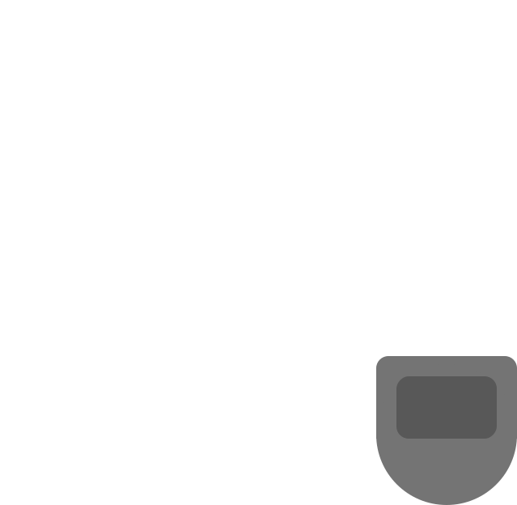
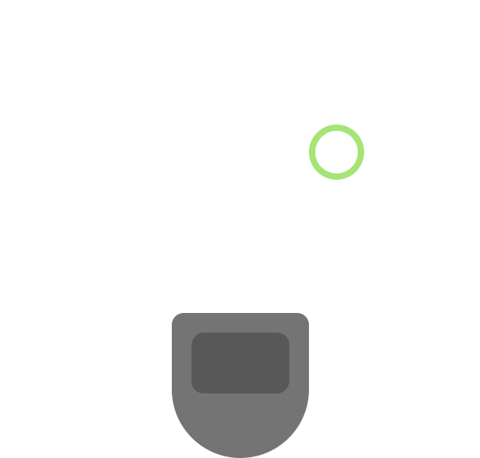
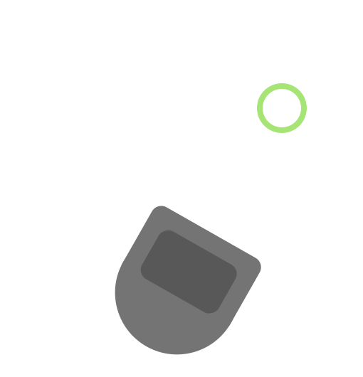

# comprobo_warmup

In your github repository, create a markdown file called README.md to serve as documentation for your project. Your writeup should answer the following questions. We expect this writeup to be done in such a way that you are proud to include it as part of your professional portfolio. As such, please make sure to write the report so that it is understandable to an external audience. Make sure to add pictures to your report, links to Youtube videos, embedded animated Gifs (these can be recorded with the tool peek).

    For each behavior, describe the problem at a high-level. Include any relevant diagrams that help explain your approach.  Discuss your strategy at a high-level and include any tricky decisions that had to be made to realize a successful implementation.
    For the finite state controller, what was the overall behavior. What were the states? What did the robot do in each state? How did you combine and how did you detect when to transition between behaviors?  Consider including a state transition diagram in your writeup.
    How was your code structured? Make sure to include a sufficient detail about the object-oriented structure you used for your project.
    What if any challenges did you face along the way?
    What would you do to improve your project if you had more time?
    What are the key takeaways from this assignment for future robotic programming projects? For each takeaway, provide a sentence or two of elaboration.

Note: don’t leave the writeup to the very end! You will have a much better time if you document as you go. The simple act of writing up your work will actually help generate new ideas and improve the organization for your robot programs.

# Teleop

## Problem

The NEATO by itself can't do much without a controller. Yes, it can gather data about its surroundings but without a node telling it what to do, the NEATO will remain stationary. For this sub-project, the task is to create a node that allows a user to control the NEATO using keybinds. A successful outcome to this task looks like: The user can drive the NEATO forward by pressing w, backward by pressing s, turn right by pressing d, and turn left by pressing a.

<div style="text-align:center">
    
</div>

## Strategy / Structure

Since this was the first sub-project, we wanted to start with the bare minimum before adding any complexity. Our strategy consisted of iterative development which looked like this: First, take the provided code and add an if statement to capture the pressing of the w key.

```python
def getKey():
    tty.setraw(sys.stdin.fileno())
    select.select([sys.stdin], [], [], 0)
    key = sys.stdin.read(1)
    termios.tcsetattr(sys.stdin, termios.TCSADRAIN, settings)
    return key

settings = termios.tcgetattr(sys.stdin)
key = None

while key != '\x03':
    key = getKey()
    if (key == "w"):
        print("W pressed!")
```

Once we saw that we can chance the control flow of the program, we replaced the print statement with a control message to send to the NEATO.

```python
if (key == "w"):
    msg.linear.x = 0.2
    msg.angular.z = 0.0

self.pub.publish(msg)
```

This gave us control to drive the NEATO forward. The last step of our iterative development strategy was to add the rest of the controls which was a trivial considering we already had the base case for the W key working.

```python
match key:
    case "w":
        msg.linear.x = 0.2
        msg.angular.z = 0.0
    case "a":
        msg.linear.x = 0.0
        msg.angular.z = 0.5
    case "s":
        msg.linear.x = -0.2
        msg.angular.z = 0.0
    case "d":
        msg.linear.x = 0.0
        msg.angular.z = -0.5

self.pub.publish(msg)
```

## Visualization


# Driving in a Square

## Problem

Now that we know that we know that the NEATO is controllable, we would like to hand off control to a computer instead of manually pressing the w, a, s, and d keys. In this problem, we are tasked to make the NEATO drive in a square autonomously. A successful outcome to this task looks like: The NEATO drives forward some determined distance, rotates left 90 degrees, drives forward some determined distance, and so on.

<div style="text-align:center">
    
</div>

## Strategy / Structure

On top of using an iterative development approach, we also decided that breaking down the problem into its fundamental components would make it simpler to approach. By looking at the neccassary actions for the NEATO to take, we noticed that there were only two translational actions the NEATO makes: drive forward distance _d_ and turn left 90°. Turning these two actions into functions is trivial:

```python
def move_forward(self, msg):
    msg.linear.x = 0.2
    msg.angular.z = 0.0
    self.pub.publish(msg)
    sleep(5)
    msg.linear.x = 0.0
    msg.angular.z = 0.0
    self.pub.publish(msg)

def turn_left(self, msg):
    msg.linear.x = 0.0
    msg.angular.z = 0.5
    self.pub.publish(msg)
    sleep(3.3)
    msg.linear.x = 0.0
    msg.angular.z = 0.0
    self.pub.publish(msg)
```

There were some non-obvious questions to answer however: How do we turn exactly 90° and how do we drive exactly distance d. Since we wanted to simple timing instead of the NEATO's odometry, the simple answer is we couldn't get the NEATO to turn and move exactly how we wanted. By utilizing gazebo and through trial and error, we tried various timing values for the move_forward and turn_left function until we got movements that we were happy with.

Now that we had our fundamental movement blocks, we moved one step up the NEATO's trajectory hierarchy to realize that to drive in a square requires moving forward and left repeatadly. Since we have functions that define these two movements, implementing this more complex movement is done by chaining them together in our main run loop:

```python
def run_loop(self):
    msg = Twist()
    self.move_forward(msg)
    self.turn_left(msg)
```

## Visualization


# Person Following

## Problem

Compared to wall following, person following adds the complexity of having to follow a _moving_ target while igorning objects that are farther away in its view. In this problem, the NEATO should scan the area in front of it using its laser scanner. Once an object is detected, the NEATO should orient itself to remain a predetermined distance away from the object. In case multiple objects are in the NEATO's view, the NEATO should follow the closest object. A successful outcome to this task looks like: If the NEATO doesn't see anything directly in front of it, it should remain stationary. Once an object enters its view box the neato should first turn to face the object and then move forward or backward to remain at the proper distance from the object.

## Strategy / Structure

We found that this problem can be divided into two parts: gathering the distance data within the NEATO's view box and orienting itself with the target based on the gathered data.

### Viewbox

<div style="text-align:center">
    
</div>

### Orientation

<div style="text-align:center">
    
</div>

Before tackling these two sub problems, we had to decide on what an object is to our NEATO. We came up with the simplest solution: the NEATO will treat the point from the laser scan that is closest to it as its target. The laser scan data comes in the form of a list with 360 elements (1 distance scan for each degree around the NEATO). We sliced the list to only get the points that were in front of the NEATO and discaded points that were further than we wanted the NEATO to track.

```python
...
self.create_subscription(LaserScan, "scan", self.process_scan, 10)
...
def process_scan(self, laser_data):
        ranges = list(laser_data.ranges)
        ranges_left = ranges_list[0:45]
        ranges_right = ranges_list[314:359]

        ranges_left_reversed = []
        ranges_right_reversed = []

        for i in reversed(range(0, 45)):
            ranges_left_reversed.append(ranges_left[i])
            ranges_right_reversed.append(ranges_right[i])

        ranges_forward = ranges_left_reversed + ranges_right_reversed
        self.ranges = [range if self.max_tracking_distance <= 5 else math.inf for range in ranges_forward]
```

Now that we have the data, we can start to use it to tell the NEATO how to orient itself. We do this processing in our main loop:

Find the closest point:

```python
closest_point = min(self.ranges)
```

Get the angle of the point relative to the NEATO. We sliced the laser scan data so that element 0 is the scan at -45°, element 1 is the scan at -44°, and so on. Using this fact we can calculate the angular error, which how much the NEATO needs to rotate to face the target directly.

```python
closest_point_idx = self.ranges.index(closest_point)
angular_error = closest_point_idx - 45
```

Finally are the two orientation checks. We structured our code so that the NEATO first orients its angular position to face the target and then moves forward or backward to remain the appropriate distance from the target. These checks are done using the guard statement pattern.

```python
# Adjust angular position (rotate)
if not (-5 < angular_error < 5):
    if angular_error > 0:
        self.turn_right(msg)
    else:
        self.turn_left(msg)
    return

# Adjust linear position (translate)
if not abs(self.follow_distance - closest_point) < 0.2:
    if self.follow_distance - closest_point < 0:
        self.move_forward(msg)
    else:
        self.move_backward(msg)
    return
```

Notice that we reused the move functions from previous projects, another benefit to putting fundamental behaviors into functions!

## Challenges

The greatest hurdle for this project was working with the laser scan data. We weren't aware that the data is given in an array format which took much of our development time away. Using print statements to get the type of the data sped up the debugging process once we realized what might be wrong. In the future, we'll resort first to printing out the types of variables when encountering issues with data from sensors.

## Visualization


# Finite-State Control

## Problem

This task requires the NEATO to perform multiple behaviors based on the current state of a system. We chose to implement a combination of square driving and person following. A successful outcome to this task looks like: The NEATO begins by driving in a square. If it doesn't detect any objects in front of it with its laser scanner it will continue driving in a square. Once an object has been detected the state will change into person following mode where it will orient itself a predetermined distance from the detected object.

<div style="text-align:center">
    
</div>

## Strategy / Structure

Since we already built the functionality for square driving and person following, all we needed to do was add in the proper state control to move between the states. Using switch statements in python was our decided.

Modifications to incorporate a FSM includes adding a class attribute to keep track of the NEATO's current state. We initialize the robot to drive in a square

```python
def __init__(self):
        super().__init__("finite_state_controller_node")
        ...
        self.state = "drive_square"
```

The only other change we need to make is in the main loop, where we add a condition to check if the state should change and a switch statement to choose what the NEATO should do depending on the state.

```python
def run_loop(self):
    ...
    is_no_detection = all(math.isinf(x) for x in self.ranges)
    ...
    match self.state:
            case "drive_square":
                if is_no_detection:
                    self.move_forward_square(msg)
                    self.turn_left_square(msg)
                    return
                else:
                    self.state = "follow_person"
                    return
            case "follow_person":
                if not is_no_detection:
                    closest_point = min(self.ranges)

                    closest_point_idx = self.ranges.index(closest_point)

                    # Index corresponds to point's angle relative to NEATO
                    angular_error = closest_point_idx - 45

                    # Adjust angular position (rotate)
                    if not (-5 < angular_error < 5):
                        if angular_error > 0:
                            self.turn_right(msg)
                        else:
                            self.turn_left(msg)
                        return

                    # Adjust linear position (translate)
                    if not abs(self.follow_distance - closest_point) < 0.2:
                        if self.follow_distance - closest_point < 0:
                            self.move_forward(msg)
                        else:
                            self.move_backward(msg)
                        return
                else:
                    self.state = "drive_square"
                    return
```

## Visualization
